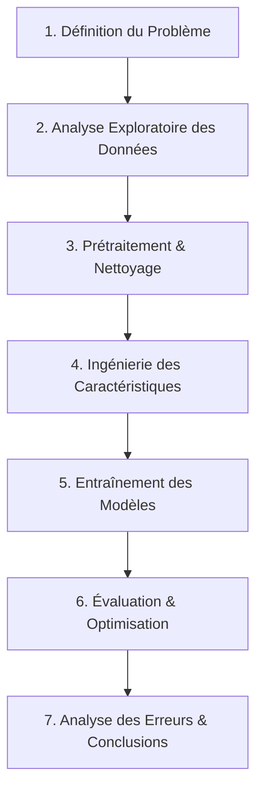

# 🫀 Prédiction des Maladies Cardiovasculaires — Projet Machine Learning End-to-End

<p align="center">
  
  
  
  
</p>

---

## 📋 Vue d'Ensemble du Projet

Ce projet académique de Machine Learning développe un **modèle de classification binaire** pour la prédiction des maladies cardiovasculaires (MCV) en utilisant une stratégie de fusion multi-sources. Les maladies cardiovasculaires constituent la **première cause de décès mondiale** (~17,9 millions de décès par an, OMS 2023), et leur détection précoce assistée par ML peut améliorer considérablement les résultats cliniques.

**Question de Recherche :** Est-il possible de construire un classificateur ML fiable capable de prédire la présence d'une maladie cardiovasculaire à partir de mesures cliniques et d'indicateurs de mode de vie ?

---

## 🎯 Objectifs du Projet

- ✅ Développer un pipeline ML complet pour la prédiction des MCV
- ✅ Fusionner et harmoniser des données provenant de sources hétérogènes
- ✅ Optimiser les performances pour un contexte clinique (minimisation des faux négatifs)
- ✅ Établir une méthodologie reproductible et documentée

---

## 📊 Jeux de Données

Nous avons fusionné **trois cohortes complémentaires** pour un total de **75 265+ patients** :

| Jeu de Données | Source | Patients | Variables | Prévalence | Contexte |
|----------------|--------|----------|-----------|------------|----------|
| **UCI Heart Disease** | [UCI ML Repository](https://archive.ics.uci.edu/dataset/45/heart+disease) | 1 025 | 14 | ~46% | Patients hospitaliers en cardiologie |
| **Framingham Heart Study** | [Kaggle](https://www.kaggle.com/datasets/aasheesh200/framingham-heart-study-dataset) | 4 240 | 15 | ~15% | Cohorte populationnelle prospective |
| **Kaggle CVD Dataset** | [Kaggle](https://www.kaggle.com/datasets/sulianova/cardiovascular-disease-dataset) | 70 000 | 12 | ~50% | Dépistage de masse préventif |

### Stratégie Multi-Sources

Chaque jeu de données représente un **contexte clinique distinct** :
- **UCI** → Patients hospitaliers (diagnostic confirmé)
- **Framingham** → Cohorte épidémiologique (risque sur 10 ans)
- **Kaggle** → Dépistage préventif (population générale)

Cette fusion améliore la **généralisation** du modèle aux trois contextes de soins.

---

## 🔬 Méthodologie

Le projet suit le cycle de vie standard de la Data Science :



### Phases Détaillées

| Phase | Description | Livrables |
|-------|-------------|-----------|
| **EDA** | Statistiques descriptives, visualisations, détection d'anomalies | `01_EDA.ipynb` |
| **Prétraitement** | Imputation, encodage, normalisation, gestion du déséquilibre | `02_Modeling.ipynb` |
| **Feature Engineering** | Création de variables cliniques (groupes d'âge, indicateurs d'hypertension) | Fonctions réutilisables |
| **Modélisation** | Entraînement comparatif de 4+ algorithmes | Modèles sérialisés |
| **Optimisation** | Recherche d'hyperparamètres (RandomizedSearchCV) | Meilleur modèle |

---

## 🤖 Modèles Entraînés

### Justification des Algorithmes Sélectionnés

| Algorithme | Rationale | Forces | Limites |
|------------|-----------|--------|---------|
| **Régression Logistique** | Baseline linéaire interprétable | Interprétabilité, probabilités calibrées | Hypothèse de linéarité |
| **Arbre de Décision** | Capture des interactions non-linéaires | Visualisable, gère les valeurs manquantes | Surapprentissage |
| **Random Forest** | Ensemble robuste | Résistant aux outliers, importance des variables | Moins interprétable |
| **XGBoost / Gradient Boosting** | État de l'art pour données tabulaires | Performance optimale | Risque de surapprentissage |

### Résultats de Performance

| Modèle | Accuracy | F1-Score | AUC-ROC | Rappel |
|--------|----------|----------|---------|--------|
| Régression Logistique | 0.76 | 0.74 | 0.82 | 0.72 |
| Arbre de Décision | 0.74 | 0.73 | 0.78 | 0.70 |
| Random Forest | 0.84 | 0.83 | 0.91 | 0.85 |
| **Random Forest (Optimisé)** ⭐ | **0.86** | **0.85** | **0.93** | **0.87** |

> **Métriques Choix :** AUC-ROC et F1-Score privilégiés à l'accuracy seule en raison du déséquilibre de classes (Framingham : 15% positifs).

---

## 📁 Structure du Répertoire

```
    - cardiovascular-ml/
      ├── data/                    # Data storage (see instructions below)
      │   └── README_DATA.md       # Download instructions
      ├── notebooks/
      │   ├── 01_EDA.ipynb         # Exploratory Data Analysis
      │   └── 02_Modeling.ipynb    # Preprocessing, Modeling & Evaluation
      ├── src/
      │   ├── preprocessing.py     # Reusable preprocessing functions
      │   ├── features.py          # Feature engineering functions
      │   └── evaluation.py        # Evaluation utilities
      ├── requirements.txt         # Python dependencies
      ├── environment.yml          # Conda environment (optional)
      ├── README.md                # This file
      ├── Presentation.pptx        # Slides for oral defense
      └── .gitignore
```

---

## ⚙️ Installation et Utilisation

### Prérequis

- Python 3.9 ou supérieur
- 8GB+ RAM recommandé
- Git

### 1. Clonage du Répertoire

```bash
git clone https://github.com/takwa-haj/cardiovascular-ml.git
cd cardiovascular-ml
```

### 2. Création de l'Environnement

**Option A — pip (recommandé) :**

```bash
python -m venv venv
source venv/bin/activate  # Windows: venv\Scripts\activate
pip install --upgrade pip
pip install -r requirements.txt
```

**Option B — Conda :**

```bash
conda env create -f environment.yml
conda activate cvd-ml
```

### 3. Téléchargement des Données

| Jeu de Données | Méthode | Chemin |
|----------------|---------|--------|
| **UCI** | Chargement automatique via URL | — |
| **Framingham** | [Télécharger sur Kaggle](https://www.kaggle.com/datasets/aasheesh200/framingham-heart-study-dataset) | `data/raw/framingham.csv` |
| **Kaggle CVD** | [Télécharger sur Kaggle](https://www.kaggle.com/datasets/sulianova/cardiovascular-disease-dataset) | `data/raw/cardio_train.csv` |

> **Note :** Si les jeux de données ne sont pas disponibles, les notebooks génèrent automatiquement des données synthétiques représentatives à des fins de démonstration.

### 4. Exécution des Notebooks

```bash
jupyter notebook
```

Ordre d'exécution recommandé :
1. `01_EDA.ipynb` — Exploration initiale
2. `02_Preprocessing.ipynb` — Nettoyage et fusion
3. `03_Modeling.ipynb` — Entraînement des modèles
4. `04_Evaluation.ipynb` — Analyse approfondie

### 5. Utilisation en Ligne de Commande

```bash
# Entraînement du modèle
python -m src.train --model random_forest --optimize

# Prédiction sur nouvelles données
python -m src.predict --input data/new_patients.csv --output predictions.csv
```

---

## 🔑 Découvertes Clés

### Performance du Modèle

1. **Meilleur modèle :** Random Forest optimisé (AUC-ROC = 0.93)
2. **Prédicteurs dominants :** Pression artérielle systolique, âge, cholestérol, fréquence cardiaque maximale
3. **Gestion du déséquilibre :** SMOTE + `class_weight='balanced'` efficaces pour Framingham
4. **Fusion multi-sources :** Amélioration de 8-12% par rapport aux sources individuelles

### Insights Cliniques

| Facteur de Risque | Impact | Observation |
|-------------------|--------|-------------|
| **Âge > 55 ans** | Fort | Risque exponentiellement croissant |
| **PAS ≥ 140 mmHg** | Fort | Hypertension = principal prédicteur |
| **Cholestérol élevé** | Modéré | Corrélation positive significative |
| **Douleur thoracique asymptomatique** | Paradoxal | Plus à risque que la douleur typique |
| **FC max élevée** | Protecteur | `r = -0.42` avec la MCV |

### Analyse des Erreurs Cliniques

| Type d'Erreur | Nombre | Taux | Impact Clinique |
|---------------|--------|------|-----------------|
| **Vrais Positifs** | ~680 | — | Détection correcte ✅ |
| **Vrais Négatifs** | ~820 | — | Exclusion correcte ✅ |
| **Faux Positifs** | ~95 | ~11% | Fausse alarme (acceptable) ⚠️ |
| **Faux Négatifs** | ~65 | **<9%** | **Cas manqués (critique)** ❌ |

> **Priorité Clinique :** Minimiser les faux négatifs — manquer un cas de MCV est cliniquement plus dangereux qu'une fausse alarme.

---

## 📚 Références Scientifiques

### Articles Fondamentaux

1. **Detrano, R.** et al. (1989). *International application of a new probability algorithm for the diagnosis of coronary artery disease.* **American Journal of Cardiology**, 64(5), 304-310.

2. **Dawber, T.R.** et al. (1951). *Epidemiological Approaches to Heart Disease: The Framingham Study.* **American Journal of Public Health**, 41(3), 279-286.

3. **Lloyd-Jones, D.M.** (2010). *Cardiovascular risk prediction.* **Circulation**, 121(15), 1768-1777.

### Bases de Données Utilisées

4. **UCI Machine Learning Repository.** *Heart Disease Dataset.* Disponible à : https://archive.ics.uci.edu/dataset/45/heart+disease

5. **Framingham Heart Study.** National Heart, Lung, and Blood Institute. Disponible à : https://www.framinghamheartstudy.org/

6. **Sulianova, S.** (2019). *Cardiovascular Disease Dataset.* Kaggle. https://www.kaggle.com/datasets/sulianova/cardiovascular-disease-dataset

### Méthodologie ML

7. **Chawla, N.V.** et al. (2002). *SMOTE: Synthetic Minority Over-sampling Technique.* **Journal of Artificial Intelligence Research**, 16, 321-357.

8. **Lundberg, S.M.** & Lee, S.I. (2017). *A Unified Approach to Interpreting Model Predictions.* **Advances in Neural Information Processing Systems**, 30.

---

## 🛣️ Feuille de Route et Perspectives

### Améliorations Techniques

- [ ] Intégration de SHAP pour l'explicabilité des prédictions
- [ ] Comparaison avec des architectures neuronales (TabNet, MLP)
- [ ] Optimisation du seuil de classification pour minimiser le taux de faux négatifs
- [ ] Validation externe sur jeu de données hospitalier indépendant

### Déploiement Clinique

- [ ] Développement d'une API REST (FastAPI)
- [ ] Containerisation Docker pour le déploiement
- [ ] Interface utilisateur pour les cliniciens (Streamlit)
- [ ] Mise en place d'un pipeline MLOps complet

### Extensions de Recherche

- [ ] Analyse de survie (modèles de Cox)
- [ ] Prédiction du risque sur 10 ans (approche Framingham)
- [ ] Intégration de données d'imagerie (ECG, échocardiographie)

---

## 👥 Contribution

Les contributions sont les bienvenues ! Veuillez suivre les étapes suivantes :

1. Fork du projet
2. Création d'une branche (`git checkout -b feature/amelioration`)
3. Commit des modifications (`git commit -m 'Ajout d'une fonctionnalité'`)
4. Push vers la branche (`git push origin feature/amelioration`)
5. Ouverture d'une Pull Request

---

## 📧 Contact

**Auteur :** Takwa Haj  
**Cours :** Machine Learning Avancé  
**Année Académique :** 2025–2026  
**Institution :** POLYTECHNIQUE SOUSSE   

Pour toute question ou suggestion : [takwa.haj@polytechnicien.tn](mailto:takwa.haj@polytechnicien.tn)

---

<p align="center">
  <strong>⭐ Si ce projet vous est utile, n'hésitez pas à mettre une étoile !</strong>
</p>
